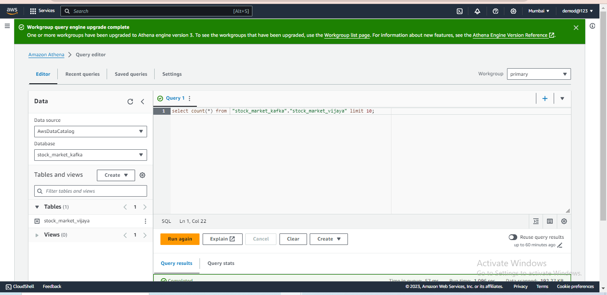
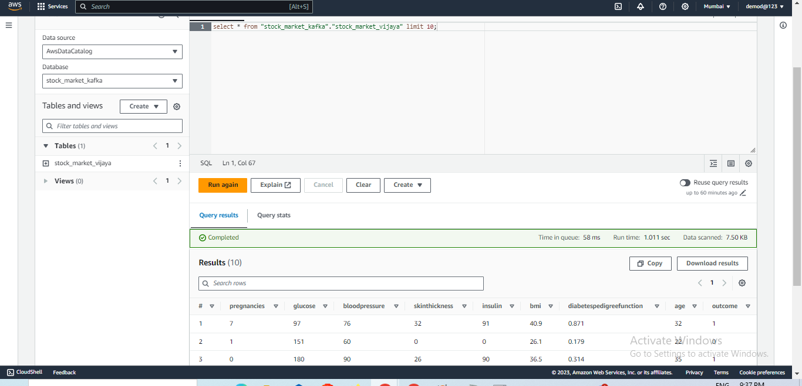
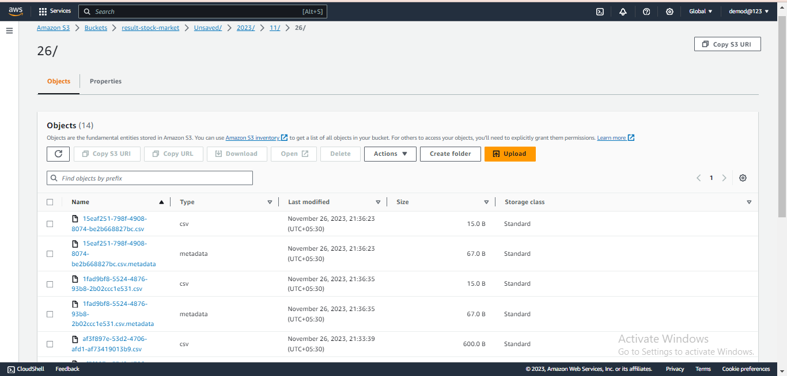

# Real-Time Stock Market Data Analysis

## Technical Overview

### Project Objective

This project implements a real-time data analysis pipeline for stock market data using Apache Kafka. The system leverages Kafka producers and consumers to facilitate efficient data streaming and processing. Additionally, it integrates with Amazon S3 for persistent storage of the analyzed data.

### Kafka Producers and Consumers

#### Kafka Producer

The Kafka producer ingests real-time stock market data and publishes it to a Kafka topic. It sends messages to the Kafka broker, acting as a centralized hub for distributing these messages to consumers.
#### Kafka Consumer
The Kafka consumer subscribes to a specific Kafka topic, processing incoming messages in real-time. In this project, consumers analyze stock market data, extract insights, and potentially make decisions based on streaming data.

### Real-Time Data Pipeline
The real-time data pipeline involves key components:

#### Kafka Producers: 
Source live stock market data, publishing it to Kafka topics.
#### Kafka Brokers: 
Intermediaries for receiving, storing, and distributing streaming data between producers and consumers.
#### Kafka Consumers: 
Subscribed to topics, process and analyze incoming data in real-time.
#### Amazon S3 Integration:
Extends the pipeline by integrating with Amazon S3 for persistent storage of analyzed stock market data.
### Interaction with S3 Buckets
Integration with Amazon S3 entails pushing relevant data from Kafka consumers to S3 buckets. This step archives and stores valuable insights, supporting historical analysis and ensuring data availability beyond the real-time processing phase.
### Results
#### Starting the kafka server

#### S3 Buckets

#### Athena query

#### Query Results

#### Resulted objects after query processing

